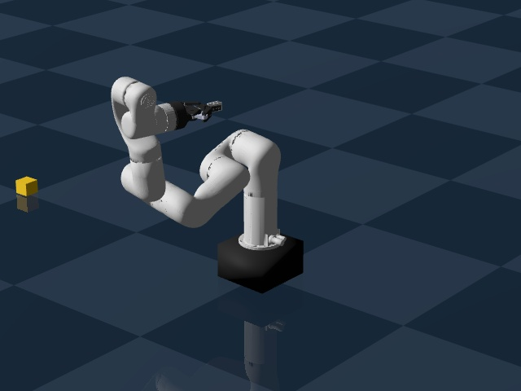
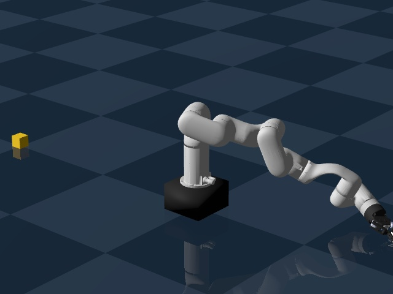
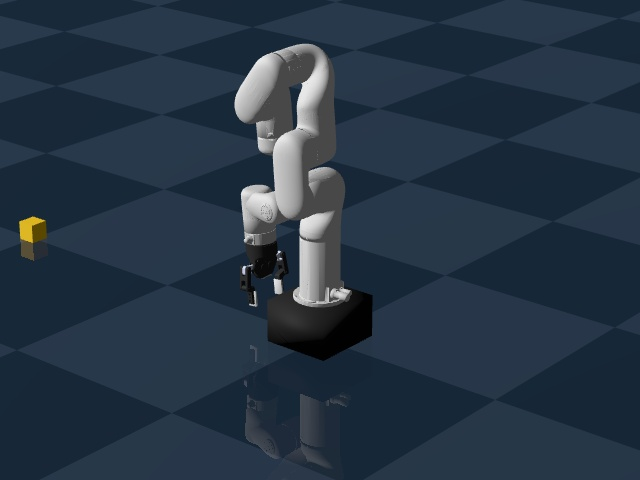
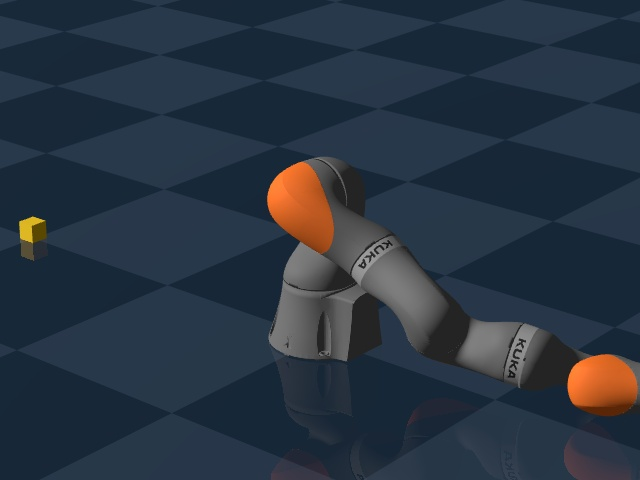
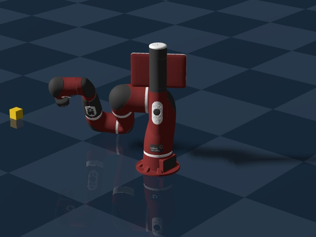
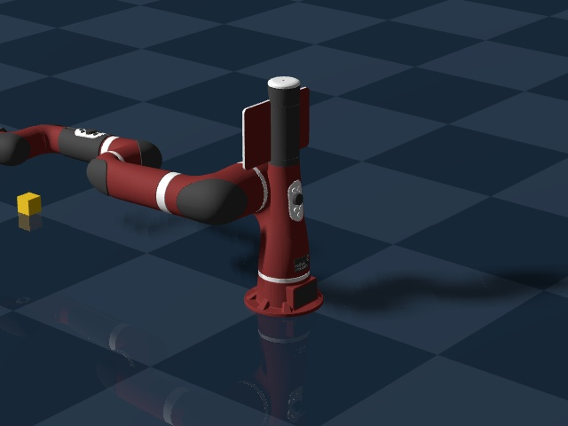
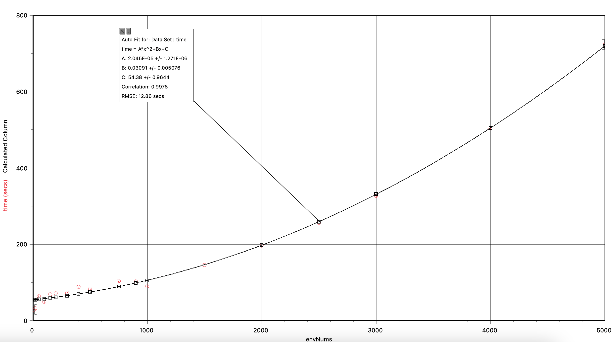

# Summary of data
We have data on 3 robots, the [x arm](../magma/lerobotTests/xarm6RobotDataTest20250529.parquet), [kuka](../magma/lerobotTests/kukaRobotDataTest20250603.parquet), and [sawyer](../magma/lerobotTests/sawyerRobotDataTest20250603.parquet) arm. They each have over 10,000 data points.

Follow these links to find the [collected data](https://huggingface.co/datasets/RadAlpaca11/lerobotTests) and associated [images](https://huggingface.co/datasets/RadAlpaca11/lerobotTests/tree/main/picsAndVids)

# Overall
We collect data using the Genesis simulator and output it as a .parquet file, which is the same format as lerobot datasets. The images are collected in a .zip file to make things neater and easier to download. The data is then uploaded to HuggingFace for easy access and sharing.

## Example images

# Some notes on the code
* We use parallel simulation running on the GPU to move a single robot for each datapoint
* The code uses forward kinematics to move the robot joints to specific angles
* The points generated are in the range of the joints, but not necessarily in the range of the robot's workspace, so some of the positions may not be safe
    * The simulator does check for collisions, but that still doesn't mean the robot is in a safe position
* To keep the file names not too long, they only use the date, so they will write over one that has been done on the same day
* The code does take a while to run with more environments
    
    A graph of the time it takes to run the code vs the number of environments. The time is in seconds, and the number of environments is the number of robots that are being simulated at the same time.
* The image .zip is not stored in the git repository, so you have to download it from [huggingface](https://huggingface.co/datasets/RadAlpaca11/lerobotTests)
* The .parquet file and the image .zip automatically get pushed to the [huggingface](https://huggingface.co/datasets/RadAlpaca11/lerobotTests) at the end of the code

# Plans
* Make the code more modular with functions and classes
* Create a safety check for the robot's workspace
